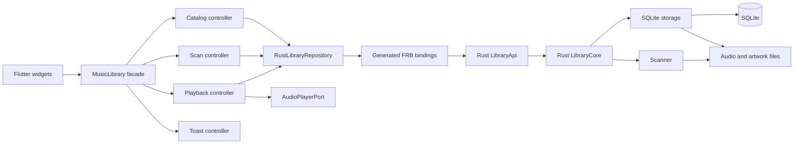
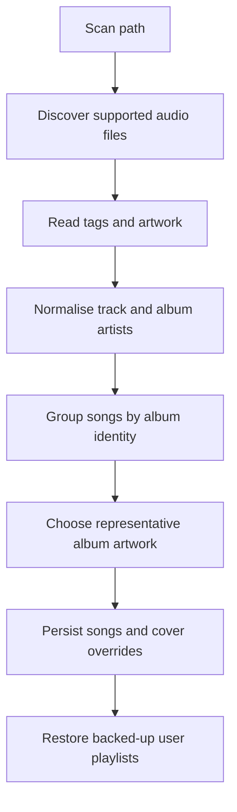

# Clutter architecture

Clutter is split into a Flutter/Dart application and a Rust library connected by Flutter Rust Bridge (FRB).

The main rule is:

> Rust owns library data and metadata behaviour. Dart owns presentation state, navigation, and platform audio control.

Keeping that boundary clear prevents the same rule being implemented differently in two languages.

## High-level data flow



Generated FRB code is plumbing. Do not put product behaviour in generated files because regeneration will overwrite it.

## Dart application

The Dart source uses a feature-first layout:

```text
lib/
├── app/                       startup, theme, and application shell
├── features/
│   ├── library/               catalog state, repository, entities, and views
│   ├── scanning/              scan paths and folder selection
│   ├── playback/              queue policy, audio port, handler, and media bar
│   ├── metadata_editor/       song, album, artist, and playlist editors
│   ├── audio_crop/            waveform, bounded preview, ffmpeg crop, and progress
│   ├── keybindings/           desktop shortcut state, key translation, and editor
│   ├── video_import/           video picking, ffmpeg extraction, progress, and import form
│   ├── search/                search dialog and search page
│   ├── quick_play/            pinned-item sidebar
│   └── settings/              settings and scan-directory controls
├── shared/                    reusable presentation, services, and theme values
└── src/rust/                  generated FRB Dart bindings
```

### Application startup

`main.dart` calls `bootstrap()` and does nothing else.

Bootstrap performs the side-effecting startup sequence:

1. Initialise Flutter bindings and FRB.
2. Resolve application directories.
3. Start the platform audio service.
4. Open the Rust library API.
5. Wrap the API in `RustLibraryRepository`.
6. On desktop, load persisted keybindings through their Rust repository adapter.
7. Construct the controllers and provide them to the widget tree.

Theme and navigation live separately from startup so they can be understood and changed without touching database or platform initialisation.

### MusicLibrary facade

Widgets continue to read one `MusicLibrary` through Provider. It is a facade rather than the owner of every piece of state.

It composes four narrower notifiers:

| Component | Responsibility |
| --- | --- |
| `LibraryCatalogController` | Cached songs, albums, artists, playlists, likes, pins, searches, and catalog refreshes |
| `LibraryScanController` | Scan paths, folder selection, scan progress, rescans, removal, and reset |
| `PlaybackController` | Current song, audio state, queue, history, looping, seeking, scrubbing, and playback persistence |
| `ToastController` | Short-lived user messages and their timer |

The facade forwards notifications from these controllers so existing `Consumer<MusicLibrary>` widgets rebuild normally.

The facade only contains workflows that cross feature boundaries. Examples include:

- releasing the active audio file before Rust rewrites its tags;
- refreshing the catalog and reconnecting playback after an edit;
- removing deleted songs from the queue;
- showing a toast after a scan or playlist operation.

Feature-specific behaviour belongs in its controller, not in the facade or a widget.

### Repository boundary

`RustLibraryRepository` is the handwritten Dart adapter around `LibraryApi`. It translates convenient Dart method calls into the named arguments generated by FRB.

Controllers depend on two contracts:

- `LibraryCatalogRepository` for catalog and scan operations;
- `PlaybackPersistence` for restoring, recording, and saving playback state.

This keeps generated bindings out of presentation files and makes controllers testable with fake implementations.

The UI currently uses Rust-generated view-data types such as `SongViewData`. They are re-exported through the library domain module so widgets do not import `src/rust` directly.

### Playback boundary

`PlaybackController` owns playback policy. `AudioPlayerPort` describes the platform operations it needs, while `ClutterAudioHandler` implements those operations with AudioService and AudioPlayer.

This division is important:

- queue, history, repeat, and previous/next decisions are application behaviour;
- opening an audio file and publishing system media controls are platform behaviour.

`PlaybackQueue` contains the mutable queue/history collections and exposes read-only views. Keeping collection manipulation separate makes ordering and looping behaviour easy to unit-test.

### Desktop keybindings

Rust owns the saved shortcut definitions, defaults, supported key-code validation, and duplicate-chord rejection. `KeybindingController` loads that configuration through `KeybindingRepository`; Dart only translates Flutter hardware key events into the canonical key codes understood by Rust.

`DesktopShortcutScope` is installed only on Linux, macOS, and Windows. It dispatches configured actions to the existing playback and search commands, ignores text-entry focus, and does not act behind modal routes. The settings editor is desktop-only and captures one main key plus optional modifiers. Escape is reserved for cancelling capture, and actions may be left unbound.

### Video imports

Dart owns the platform video picker and ffmpegkitnext session because those are Flutter platform integrations. The video import controller probes the selected video, reports extraction progress, cancels the active session, and keeps the resulting mp3 temporary until the user confirms its metadata.

Rust owns the final commit. It validates and writes tags, moves the mp3 into the managed imports directory, applies the normal artist and album identity rules, and inserts the song into sqlite. This keeps an abandoned or failed extraction out of the library database.

The Flutter plugin currently exposes this feature on Android, iOS, and macOS only. See [ffmpegkitnext setup](FFMPEG_KIT.md) for the native build process.

### Reversible audio cropping

Dart owns the temporary crop workflow because waveform generation, bounded preview, and ffmpegkitnext are platform integrations. The crop controller keeps the playhead inside the selected range, while the metadata form owns pending selection and temporary-output cleanup.

Rust owns the durable result. A cropped song keeps one full-length original under the managed `Music/originals` directory and stores its crop boundaries in SQLite. Re-cropping always starts from that retained file. Restore writes current tags onto the original audio, swaps it back atomically, and removes the cropped MP3 and retained copy only after commit.

`SongViewData.crop` is the source of truth for cropped state. Dart must not infer it from file extensions or names. Cropping is currently available on Android, iOS, and macOS, matching the bundled ffmpegkitnext targets.

### Remote sources

The search tab is reserved for non-local sources. It renders a compact source
selector and gives each source its own controller and presentation. Local
catalog search remains in the library views.

SFTP is the first remote source. Rust owns named profiles, trusted server-key
fingerprints, sessions, root-confined browsing, recursive transfer jobs,
progress, cancellation, and importing downloaded audio through the normal tag
scanner. A successful file is written under `Music/imports/sftp` with a unique
name, so downloading the same remote path again creates a separate song and
never overwrites local metadata or crop edits.

Passwords are the one exception to Rust persistence. Dart's platform adapter
stores them in Keychain, Keystore, Credential Manager, or libsecret and passes
the secret to Rust only when opening a session. SQLite stores the profile and
SHA-256 host-key fingerprint but never the password. A new or changed server
must be explicitly trusted, and later fingerprint changes are rejected before
authentication.

Linux packaging must provide `libsecret-1-dev` while building and
`libsecret-1-0` at runtime. Windows builds need the C++ ATL component from the
Visual Studio Build Tools used by the secure-storage plugin.

Download jobs use shared bridge models for discovery, transfer, import, and
terminal states. A future YouTube source can reuse the source selector and job
presentation while keeping its provider-specific resolver outside the SFTP
implementation.

### Widget responsibilities

Widgets should:

- render controller state;
- collect user input;
- call one facade command;
- own short-lived presentation state such as text controllers, focus nodes, hover state, and dialog selection.

Widgets should not perform SQL-like joins, decide album identity, rewrite tags, or duplicate Rust validation.

After awaiting work in a stateful widget, check `mounted` before using its `BuildContext` or calling `setState`.

## Rust library

Rust remains a single Cargo package, split into internal modules:

```text
rust/src/
├── api/                       thin FRB-facing API and bridge models
├── core/                      application operations grouped by purpose
├── scan/                      audio discovery, parsing, grouping, and import
├── media/                     audio tag reading and writing
├── storage/sqlite/            SQLite models, queries, edits, backup, and recovery
├── remote/                    remote sessions, browsing, and download jobs
└── frb_generated.rs           generated bridge plumbing
```

### FRB API layer

`LibraryApi` is the only Dart-facing Rust object. It contains bridge-safe request and response types and short forwarding methods.

The API layer may:

- convert FRB request enums into internal Rust enums;
- convert internal rows into flattened view data;
- map internal results into bridge-compatible results.

It should not contain SQL, directory traversal, metadata parsing, or transaction orchestration.

When the public Rust API changes, regenerate FRB output and update Dart through the repository boundary.

### Core layer

`LibraryCore` is the Rust application entry point. Its implementation is split into catalog, editing, playlist, and playback modules.

Core methods express the operation being requested and delegate persistence to `SqliteLibraryStore`. Scanning is initiated here so the bridge does not know how discovery and persistence are coordinated.

### Scanner

The scanner processes a directory in explicit stages:



Pure grouping and selection functions are kept separate from file and database operations. A song whose artwork differs from the representative album artwork receives its own override.

### SQLite storage

`SqliteLibraryStore` owns the database connection and stored-path conversion. Its models and metadata-edit orchestration are split into focused modules.

SQLite is the source of truth for:

- songs, albums, artists, and their relationships;
- playlists and playlist membership;
- pins and recently played items;
- scan paths and playback state;
- desktop keybinding definitions;
- relative paths to managed artwork and audio files.
- retained full-length originals and their active crop boundaries.
- SFTP profiles, trusted fingerprints, and download history.

Paths inside the application base directory are stored relatively. Mobile application container paths can change between launches, so absolute sandbox paths would become stale.

### Metadata edits and file safety

Song and album edits can affect both SQLite and audio files. The edit path therefore stages work before replacing originals:

1. Validate and normalise the edit request.
2. Stage new managed artwork when required.
3. Open a SQLite transaction and resolve destination artists/albums.
4. Copy affected audio files to staged files.
5. Write and verify tags on the staged files.
6. Write a recovery journal.
7. Activate staged files and commit SQLite.
8. Remove backups, the recovery record, and superseded artwork.

Crop and restore operations use the same sequence. For a first crop, Rust also verifies and retains the full-length source before replacing the active file. The song ID never changes, so playlists, likes, pins, playback history, and queue references remain valid.

If activation or commit fails, prepared files are rolled back. On startup, an interrupted operation is recovered using the journal and database operation record.

Do not simplify this sequence into independent "write file" and "update database" calls; doing so can leave the library and audio files disagreeing after a crash.

### Media module

The media module reads raw tags and writes validated metadata to staged audio files. It has no FRB dependency.

`MetadataWrite` groups tag values into one request instead of passing a long list of unrelated arguments. This makes call sites clearer and reduces accidental field ordering mistakes.

### Optional remote module

The SFTP prototype is isolated behind the `remote-sftp` Cargo feature. Normal application builds do not compile it or its optional dependencies. Its live test is ignored unless a suitable host is available.

## Adding new work

Use these placement rules:

| New behaviour | Location |
| --- | --- |
| Database, metadata, album identity, or scan rule | Rust core/storage/scan/media |
| New Dart call into Rust | Rust API, regenerated FRB output, then Dart repository adapter |
| Cached library or search state | Library catalog controller |
| Scan progress or folder selection | Scan controller |
| Queue or playback policy | Playback controller or playback queue |
| Keybinding defaults, validation, conflicts, or persistence | Rust keybinding storage/core |
| Desktop key capture or shortcut editing UI | Dart keybindings feature |
| Video picking, extraction progress, and cancellation | Dart video import feature |
| Waveform generation, crop preview, and temporary MP3 encoding | Dart audio crop feature |
| Retained originals, cropped state, and restore transactions | Rust core/storage |
| Final extracted-song tags, file placement, and indexing | Rust core/storage |
| Platform audio implementation | Playback infrastructure |
| Feature-specific UI | That feature's presentation folder |
| Reusable UI primitive | Shared presentation |
| Cross-feature workflow | `MusicLibrary` facade |

Before adding state to `MusicLibrary`, first ask whether one of its child controllers is the actual owner.

## Validation

The expected checks are:

```sh
flutter analyze
flutter test

cd rust
cargo fmt --check
cargo test --all-features --lib
cargo clippy --all-features --lib -- -D warnings
```

Generated FRB files are exempt from handwritten style and function-length guidelines. Handwritten comments use the repository's lowercase, developer-oriented style.
